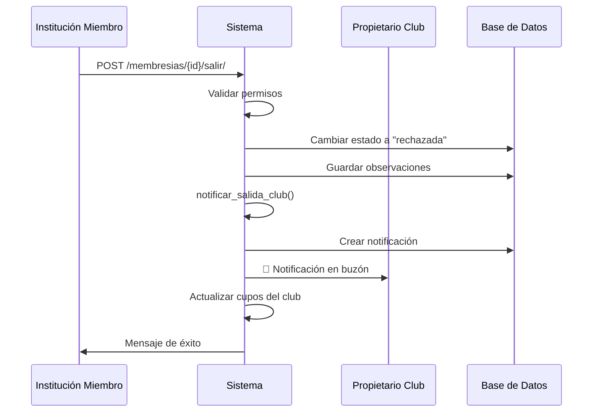

# 🔔 Sistema de Notificaciones: Salida de Club

## 📋 Descripción General

Implementación profesional del sistema de notificaciones cuando una institución se retira voluntariamente de un club. La notificación se envía al **propietario del club** (institución creadora) para mantenerlo informado sobre cambios en la membresía.

---

## 🎯 Arquitectura de Notificaciones

### Destinatarios

| Rol | Recibe Notificación | Razón |
|-----|---------------------|-------|
| **Propietario del Club** | ✅ SÍ | Necesita saber por qué una institución se retiró para mejorar la gestión del club |
| **Federación** | ❌ NO | Es una decisión operativa entre instituciones, no requiere supervisión |
| **Institución Saliente** | ❌ NO | Ya conoce su propia acción |

### Justificación Técnica

La notificación al propietario del club es crítica porque:

1. **Feedback Operativo**: El motivo de salida proporciona información valiosa para mejorar el club
2. **Gestión de Cupos**: El propietario debe saber cuándo se liberan cupos
3. **Trazabilidad**: Mantiene un registro de cambios en la membresía
4. **Comunicación**: Permite al propietario contactar a la institución si es necesario

---

## 🛠 Implementación Técnica

### 1. Modelo de Notificación

**Archivo**: `registry/models.py`

```python
TIPO_CHOICES = [
    # ... otros tipos
    ("salida_club", "Salida de Club"),  # ✅ NUEVO
    ("sistema", "Notificación del Sistema"),
]
```

### 2. Función de Notificación

**Archivo**: `registry/notificaciones.py`

```python
def notificar_salida_club(membresia, motivo=''):
    """Notifica al propietario del club que una institución se retiró.
    
    Args:
        membresia: Objeto MembresiaClu con la información de la salida
        motivo: Motivo opcional proporcionado por la institución
    """
    club = membresia.club
    institucion_saliente = membresia.institucion
    
    # Notificar al coordinador del club (propietario)
    if club.coordinador:
        mensaje = f'La institución "{institucion_saliente.nombre}" se ha retirado del club "{club.nombre}".'
        
        if motivo:
            mensaje += f'\n\n📝 Motivo: {motivo}'
        else:
            mensaje += '\n\n(No se proporcionó motivo específico)'
        
        # Información adicional sobre cupos
        miembros_actuales = club.membresias.filter(estado="aprobada").count()
        mensaje += f'\n\n📊 Miembros actuales: {miembros_actuales}'
        if club.cupo_maximo:
            cupos_disponibles = club.cupo_maximo - miembros_actuales
            mensaje += f' / {club.cupo_maximo} (Cupos disponibles: {cupos_disponibles})'
        
        crear_notificacion(
            destinatario=club.coordinador,
            tipo='salida_club',
            titulo=f'🚪 Salida de Miembro: {institucion_saliente.nombre}',
            mensaje=mensaje,
            club=club
        )
```

### 3. Integración en Vista

**Archivo**: `registry/views_institucional.py`

```python
@login_required
def salir_club(request, membresia_id):
    """Permite a una institución salirse de un club."""
    # ... validaciones
    
    if request.method == "POST":
        motivo = request.POST.get("motivo", "").strip()
        
        # Cambiar estado
        membresia.estado = "rechazada"
        membresia.observaciones = f"Salida voluntaria: {motivo}" if motivo else "Salida voluntaria"
        membresia.fecha_respuesta = timezone.now()
        membresia.save()
        
        # ✅ NOTIFICAR AL PROPIETARIO
        notificar_salida_club(membresia, motivo)
        
        # Actualizar cupos del club
        # ...
```

---

## 📊 Contenido de la Notificación

### Estructura del Mensaje

```
🚪 Salida de Miembro: [Nombre Institución]

La institución "[Nombre]" se ha retirado del club "[Nombre Club]".

📝 Motivo: [Motivo proporcionado por la institución]
(o "No se proporcionó motivo específico")

📊 Miembros actuales: X / Y (Cupos disponibles: Z)
```

### Ejemplo Real

```
🚪 Salida de Miembro: Instituto Tecnológico de Caracas

La institución "Instituto Tecnológico de Caracas" se ha retirado del club "Robótica Avanzada".

📝 Motivo: Cambio en prioridades institucionales para el próximo semestre

📊 Miembros actuales: 8 / 10 (Cupos disponibles: 2)
```

---

## 🔄 Flujo Completo



---

## 🎨 Características de la Notificación

### ✅ Información Incluida

- ✅ Nombre de la institución que se retiró
- ✅ Nombre del club
- ✅ Motivo de salida (si se proporcionó)
- ✅ Estadísticas actualizadas de membresía
- ✅ Cupos disponibles después de la salida
- ✅ Fecha y hora de la notificación

### 🎯 Beneficios

1. **Transparencia**: El propietario sabe exactamente qué pasó
2. **Feedback**: El motivo ayuda a mejorar el club
3. **Gestión**: Información actualizada de cupos
4. **Trazabilidad**: Registro permanente en el sistema
5. **Comunicación**: Base para contacto posterior si es necesario

---

## 🔐 Seguridad y Privacidad

### Validaciones Implementadas

- ✅ Solo la institución miembro puede salirse
- ✅ Solo se puede salir de membresías aprobadas
- ✅ El motivo es opcional (privacidad)
- ✅ La notificación solo va al propietario del club
- ✅ No se expone información sensible

### Privacidad del Motivo

El motivo de salida es **opcional** para respetar la privacidad de la institución. Si no se proporciona, la notificación indica claramente que no se especificó motivo.

---

## 📁 Archivos Modificados

| Archivo | Cambios |
|---------|---------|
| `registry/models.py` | Agregado tipo `"salida_club"` a `TIPO_CHOICES` |
| `registry/notificaciones.py` | Nueva función `notificar_salida_club()` |
| `registry/views_institucional.py` | Integración de notificación en `salir_club()` |
| `registry/migrations/0020_*.py` | Migración para nuevo tipo de notificación |

---

## 🧪 Testing

### Casos de Prueba

1. **Salida con motivo**: Verificar que el motivo aparece en la notificación
2. **Salida sin motivo**: Verificar mensaje por defecto
3. **Notificación al propietario**: Verificar que solo el propietario recibe la notificación
4. **Información de cupos**: Verificar cálculo correcto de cupos disponibles
5. **Múltiples salidas**: Verificar que cada salida genera su notificación

### Comando de Prueba

```bash
# Verificar que la migración se aplicó correctamente
docker compose exec web python manage.py showmigrations registry

# Verificar que el tipo de notificación existe
docker compose exec web python manage.py shell
>>> from registry.models import Notificacion
>>> dict(Notificacion.TIPO_CHOICES)
```

---

## 📈 Métricas y Monitoreo

### KPIs Sugeridos

- Número de salidas por club
- Porcentaje de salidas con motivo vs sin motivo
- Tiempo promedio de permanencia en un club
- Motivos más comunes de salida

### Dashboard Propietario

El propietario del club puede ver:
- Notificaciones de salidas en su buzón
- Historial de membresías en el panel de gestión
- Estadísticas de rotación de miembros

---

## 🚀 Mejoras Futuras

### Fase 2 (Opcional)

1. **Notificación a Federación**: Si se detectan patrones de salidas masivas
2. **Encuesta de Salida**: Formulario estructurado con opciones predefinidas
3. **Análisis de Sentimiento**: Clasificación automática de motivos
4. **Alertas Tempranas**: Notificar si múltiples instituciones salen en corto tiempo
5. **Estadísticas Agregadas**: Dashboard con análisis de motivos de salida

---

## 📞 Soporte

Para consultas sobre el sistema de notificaciones:
- Revisar logs en: `logs/django.log`
- Verificar notificaciones en: `/notificaciones/`
- Consultar historial de membresías en panel de gestión

---

## ✅ Checklist de Implementación

- [x] Agregar tipo de notificación al modelo
- [x] Crear función `notificar_salida_club()`
- [x] Integrar en vista `salir_club()`
- [x] Crear y aplicar migración
- [x] Documentar implementación
- [x] Validar permisos y seguridad
- [x] Incluir información de cupos
- [x] Manejar caso sin motivo

---

**Fecha de Implementación**: 2024  
**Versión**: 1.0  
**Estado**: ✅ Implementado y Funcional
