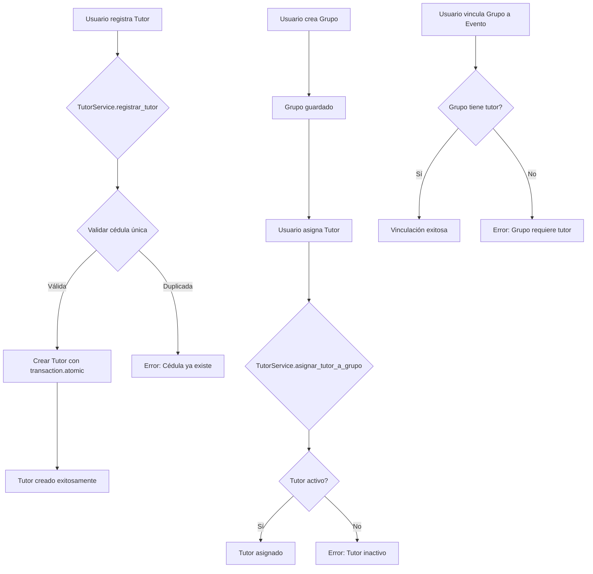

# Workflow de Ingreso - Sistema de Registro

## Registro de Tutores

### Descripción General

El sistema permite registrar tutores que pueden ser asignados a grupos de participantes. Cada tutor está asociado a una institución y puede tener múltiples grupos asignados.

### Modelo de Datos

#### Tutor

| Campo | Tipo | Descripción |
|-------|------|-------------|
| id | UUID | Identificador único |
| institucion | FK | Institución donde trabaja el tutor |
| nombres | CharField(100) | Nombres del tutor |
| apellidos | CharField(100) | Apellidos del tutor |
| cedula | CharField(20) | Cédula de identidad (única) |
| telefono | CharField(20) | Número de teléfono |
| email | EmailField | Correo electrónico |
| profesion | CharField(100) | Profesión (opcional) |
| experiencia | TextField | Experiencia relevante (opcional) |
| status | Enum | Estado: 'activo' o 'inactivo' |
| created_at | DateTime | Fecha de creación |

### Relaciones

```
Institucion 1 ──── N Tutor
Tutor N ────────── N Grupo
Grupo N ────────── N Participante
Grupo 1 ────────── 0..1 Evento
```

### Reglas de Negocio

1. **Cédula Única**: No pueden existir dos tutores con la misma cédula.
2. **Validación de Grupo**: Un grupo debe tener al menos un tutor asignado antes de vincularse a un evento.
3. **Tutor Activo**: Solo los tutores con status='activo' pueden ser asignados a nuevos grupos.
4. **Protección de Integridad**: No se puede remover el último tutor de un grupo que ya está vinculado a un evento.

### Flujo de Trabajo



### Endpoints Disponibles

| Ruta | Método | Descripción |
|------|--------|-------------|
| `/tutores/` | GET | Lista todos los tutores |
| `/tutores/crear/` | GET, POST | Crear nuevo tutor |
| `/tutores/<uuid:id>/` | GET | Ver detalle de tutor |
| `/tutores/<uuid:id>/editar/` | GET, POST | Editar tutor |
| `/tutores/<uuid:id>/cambiar-estado/` | POST | Cambiar estado activo/inactivo |
| `/tutores/buscar/` | GET | Búsqueda AJAX de tutores |
| `/grupos/<int:id>/tutores/` | GET, POST | Asignar tutores a grupo |
| `/grupos/<int:grupo_id>/tutores/<uuid:tutor_id>/remover/` | POST | Remover tutor de grupo |

### Servicio TutorService

El servicio `TutorService` encapsula la lógica de negocio:

```python
from registry.services import TutorService

# Registrar tutor
tutor = TutorService.registrar_tutor(
    institucion=institucion,
    datos_tutor={
        'nombres': 'Juan',
        'apellidos': 'Pérez',
        'cedula': 'V12345678',
        'telefono': '0414-1234567',
        'email': 'juan@example.com',
        'profesion': 'Ingeniero',
        'experiencia': '5 años en robótica',
        'status': 'activo'
    },
    usuario_solicitante=request.user
)

# Asignar tutor a grupo
TutorService.asignar_tutor_a_grupo(tutor, grupo, request.user)

# Validar grupo listo para evento
if TutorService.validar_grupo_listo_para_evento(grupo):
    # Vincular a evento
    pass
```

### Migración de Base de Datos

La migración `0024_create_tutor_model.py` realiza:

1. Crea el modelo `Tutor` con todos los campos
2. Agrega la relación M2M `tutores` al modelo `Grupo`
3. Elimina los campos legacy del modelo `Grupo`:
   - `tutor_nombre`
   - `tutor_apellidos`
   - `tutor_cedula`
   - `tutor_telefono`

### Vistas y Templates

| Vista | Template | Descripción |
|-------|----------|-------------|
| `lista_tutores` | `lista_tutores.html` | Lista con filtros |
| `crear_tutor` | `form_tutor.html` | Formulario de registro |
| `editar_tutor` | `form_tutor.html` | Formulario de edición |
| `detalle_tutor` | `detalle_tutor.html` | Detalles y grupos asignados |
| `asignar_tutor_grupo` | `asignar_tutor_grupo.html` | Asignación de tutores |

### Permisos

- Todos los usuarios autenticados pueden ver la lista de tutores
- Los usuarios institucionales pueden crear tutores para su institución
- Los administradores pueden editar cualquier tutor

### Consideraciones Técnicas

1. **Índices**: Se crearon índices en `cedula` y `(status, institucion)` para optimizar consultas.
2. **select_related**: Usar en consultas que involucran `institucion` para evitar N+1 queries.
3. **prefetch_related**: Usar para la relación M2M `tutores` en consultas de grupos.
4. **transaction.atomic**: Todas las operaciones de escritura usan transacciones atómicas.

---

## Historial de Cambios

| Fecha | Versión | Cambio |
|-------|---------|--------|
| 2026-02-22 | 1.0 | Creación inicial del modelo Tutor y relaciones |
