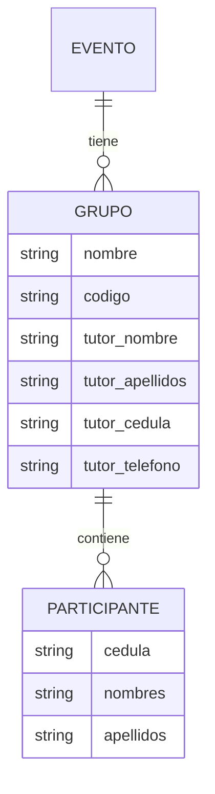
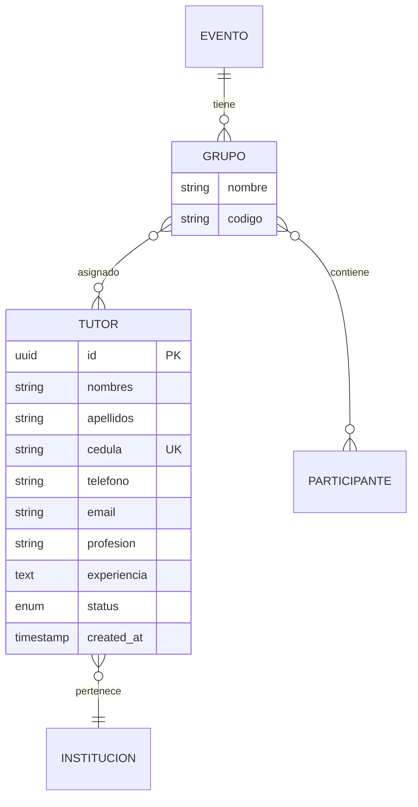
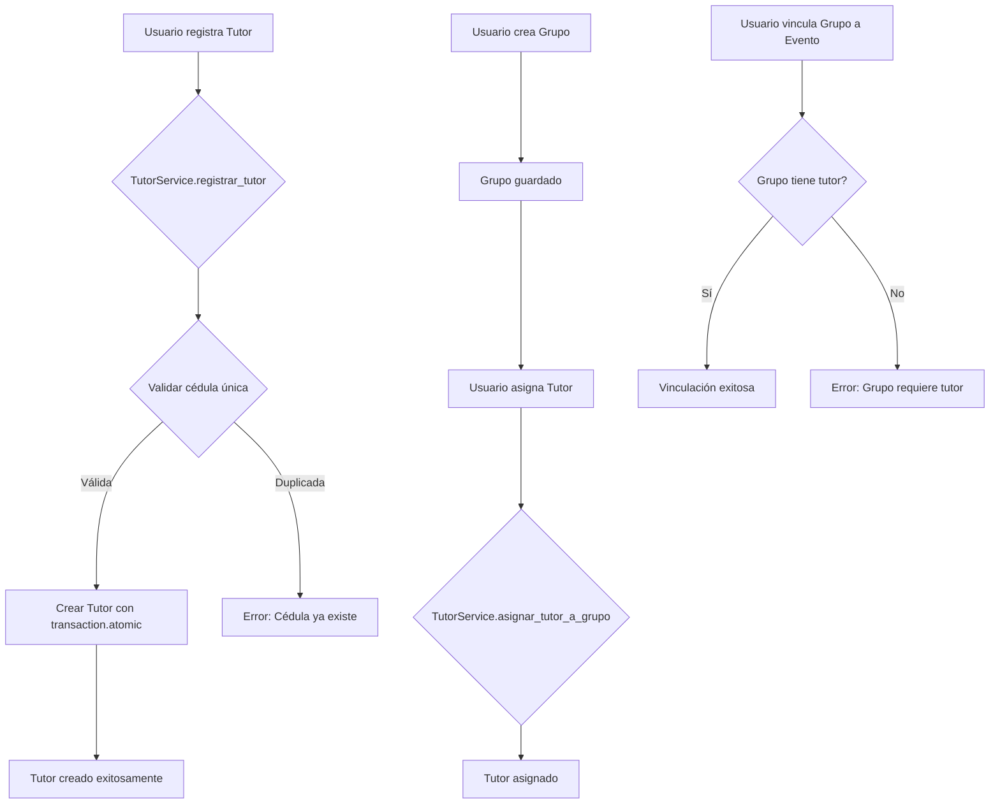

# Plan de Implementación: Modelo Tutor

## Resumen Ejecutivo

Este plan detalla la implementación del Registro de Tutores y su integración con el flujo de trabajo actual de Eventos y Grupos. Se incluye la creación del modelo Tutor, relaciones Many-to-Many, validaciones de integridad, servicios, formularios y vistas.

---

## 1. Arquitectura Actual vs Propuesta

### Diagrama de Entidad-Relación Actual



### Diagrama de Entidad-Relación Propuesta



---

## 2. Supuestos Razonables Aplicados

| Aspecto | Decisión | Justificación |
|---------|----------|---------------|
| Migración de datos | **Eliminar campos legacy** | Simplificación del modelo y código |
| Relación Tutor-Institución | Institución donde trabaja | Consistente con modelo Participante |
| Validación de Grupo | Solo Tutores requeridos | Especificación literal del requerimiento |
| Campos legacy | **Eliminar completamente** | Limpieza de estructura de datos |

---

## 3. Detalle de Tareas

### 3.1 Modelo Tutor (models.py)

**Ubicación:** `SistemaRegistro/registry/models.py`

**Especificación del modelo:**

```python
class Tutor(models.Model):
    """Modelo para representar tutores de grupos."""
    
    STATUS_CHOICES = [
        ('activo', 'Activo'),
        ('inactivo', 'Inactivo'),
    ]
    
    id = models.UUIDField(
        primary_key=True, 
        default=uuid.uuid4, 
        editable=False
    )
    institucion = models.ForeignKey(
        Institucion,
        on_delete=models.PROTECT,
        related_name='tutores',
        verbose_name='Institución'
    )
    nombres = models.CharField(max_length=100)
    apellidos = models.CharField(max_length=100)
    cedula = models.CharField(
        max_length=20, 
        unique=True,
        db_index=True,
        validators=[RegexValidator(regex=r'^[VE0-9]+$', message='Cédula válida requerida')]
    )
    telefono = models.CharField(max_length=20)
    email = models.EmailField()
    profesion = models.CharField(max_length=100, blank=True)
    experiencia = models.TextField(blank=True)
    status = models.CharField(
        max_length=10,
        choices=STATUS_CHOICES,
        default='activo',
        db_index=True
    )
    created_at = models.DateTimeField(auto_now_add=True)
    
    class Meta:
        verbose_name = 'Tutor'
        verbose_name_plural = 'Tutores'
        ordering = ['-created_at']
        indexes = [
            models.Index(fields=['cedula'], name='idx_tutor_cedula'),
            models.Index(fields=['status', 'institucion'], name='idx_tutor_status_inst'),
        ]
```

### 3.2 Modificación del Modelo Grupo

**Cambios requeridos:**

1. Agregar relación M2M con Tutor
2. **ELIMINAR** campos legacy de tutor (tutor_nombre, tutor_apellidos, tutor_cedula, tutor_telefono)
3. Implementar validación en método `clean()` o `save()`

```python
class Grupo(models.Model):
    # ... campos existentes ...
    
    # Nueva relación M2M
    tutores = models.ManyToManyField(
        'Tutor',
        related_name='grupos',
        verbose_name='Tutores asignados',
        blank=True
    )
    
    # NOTA: Los campos legacy de tutor serán ELIMINADOS
    # tutor_nombre, tutor_apellidos, tutor_cedula, tutor_telefono
    
    def clean(self):
        super().clean()
        # Validación: Grupo necesita tutor para vincularse a evento
        if self.evento_id and self.pk:
            if not self.tutores.exists():
                raise ValidationError(
                    'Un grupo debe tener al menos un tutor asignado '
                    'antes de vincularse a un evento.'
                )
```

### 3.3 Servicio TutorService

**Ubicación:** `SistemaRegistro/registry/services/tutor_service.py`

**Métodos requeridos:**

```python
class TutorService:
    @staticmethod
    def registrar_tutor(
        institucion: Institucion,
        datos_tutor: dict,
        usuario_solicitante: User = None
    ) -> Tutor:
        """
        Registra un nuevo tutor validando cédula única.
        
        Args:
            institucion: Institución donde trabaja el tutor.
            datos_tutor: Diccionario con nombres, apellidos, cedula, etc.
            usuario_solicitante: Usuario que registra (para auditoría).
            
        Returns:
            Tutor: El tutor creado.
            
        Raises:
            ValidationError: Si la cédula ya existe.
        """
        
    @staticmethod
    def asignar_tutor_a_grupo(
        tutor: Tutor,
        grupo: Grupo,
        usuario: User = None
    ) -> None:
        """
        Asigna un tutor a un grupo específico.
        
        Usa transaction.atomic para garantizar integridad.
        """
```

### 3.4 Formulario TutorForm

**Ubicación:** `SistemaRegistro/registry/forms.py`

```python
class TutorForm(forms.ModelForm):
    class Meta:
        model = Tutor
        fields = [
            'institucion', 'nombres', 'apellidos', 'cedula',
            'telefono', 'email', 'profesion', 'experiencia', 'status'
        ]
        widgets = {
            'experiencia': forms.Textarea(attrs={'rows': 3}),
        }
```

### 3.5 Vistas Requeridas

**Ubicación:** `SistemaRegistro/registry/views_tutores.py` (nuevo archivo)

| Vista | URL | Descripción |
|-------|-----|-------------|
| `lista_tutores` | `/tutores/` | Lista todos los tutores con filtros |
| `crear_tutor` | `/tutores/crear/` | Formulario de registro |
| `editar_tutor` | `/tutores/<id>/editar/` | Editar tutor existente |
| `detalle_tutor` | `/tutores/<id>/` | Ver detalles del tutor |
| `asignar_tutor_grupo` | `/grupos/<id>/agregar-tutor/` | Asignar tutor a grupo |

### 3.6 Templates Requeridos

| Template | Ubicación |
|----------|-----------|
| `lista_tutores.html` | `templates/registry/` |
| `form_tutor.html` | `templates/registry/` |
| `detalle_tutor.html` | `templates/registry/` |
| `partial_selector_tutor.html` | `templates/registry/partials/` |

### 3.7 Modificaciones a Vistas Existentes

**En `views_eventos.py`:**
- Agregar selector de tutores en creación/edición de eventos
- Validar que grupos tengan tutor antes de inscribir

**En tabla de Grupos:**
- Agregar botón "Agregar Tutor" con modal o redirección

---

## 4. Flujo de Trabajo Propuesto



---

## 5. Migración de Base de Datos

### Orden de Migraciones

1. **Crear modelo Tutor** - Tabla nueva con todos los campos
2. **Agregar relación M2M** - Tabla intermedia `grupo_tutores`
3. **Eliminar campos legacy** - Remover tutor_nombre, tutor_apellidos, tutor_cedula, tutor_telefono del modelo Grupo

### Migración Simplificada

```python
# No se requiere data migration
# Los campos legacy se eliminan directamente
# Los grupos existentes deberán asignar tutores manualmente después de la migración

from django.db import migrations

class Migration(migrations.Migration):
    dependencies = [
        ('registry', '0023_workflow_federado_membresias'),
    ]

    operations = [
        # Crear modelo Tutor
        migrations.CreateModel(
            name='Tutor',
            fields=[
                # ... campos del modelo Tutor ...
            ],
        ),
        # Agregar relación M2M a Grupo
        migrations.AddField(
            model_name='grupo',
            name='tutores',
            field=models.ManyToManyField(
                'Tutor',
                related_name='grupos',
                verbose_name='Tutores asignados',
                blank=True
            ),
        ),
        # Eliminar campos legacy
        migrations.RemoveField(model_name='grupo', name='tutor_nombre'),
        migrations.RemoveField(model_name='grupo', name='tutor_apellidos'),
        migrations.RemoveField(model_name='grupo', name='tutor_cedula'),
        migrations.RemoveField(model_name='grupo', name='tutor_telefono'),
    ]
```

---

## 6. Checklist de Implementación

- [ ] Crear modelo Tutor con todos los campos especificados
- [ ] Agregar relación M2M tutores en modelo Grupo
- [ ] **Eliminar campos legacy** de tutor del modelo Grupo
- [ ] Implementar validación de integridad (Grupo requiere Tutor para Evento)
- [ ] Crear TutorService con métodos registrar_tutor y asignar_tutor_a_grupo
- [ ] Crear TutorForm
- [ ] Crear vistas de gestión de tutores
- [ ] Crear templates para tutores
- [ ] Agregar botón "Registrar Tutor" en navegación
- [ ] Agregar selector de tutores en vistas de Grupo
- [ ] Agregar botón "Agregar Tutor" en tabla de Grupos
- [ ] Crear migración para eliminar campos legacy
- [ ] Actualizar urls.py
- [ ] Documentar en docs/workflow_ingreso.md
- [ ] Crear tests unitarios

---

## 7. Consideraciones Técnicas

### Estándares a Aplicar

- **Type hints:** Todos los métodos deben tener anotaciones de tipo
- **PostgreSQL Index:** Índice en campo `cedula` con `db_index=True`
- **select_related:** Usar en queries que involucran `institucion`
- **transaction.atomic:** Para operaciones de creación/asignación

### Seguridad

- Validar permisos de usuario antes de crear/editar tutores
- Sanitizar entrada de datos en formularios
- Usar `PROTECT` en FK para evitar eliminación accidental de instituciones con tutores

### Rendimiento

- Usar `prefetch_related` para relaciones M2M
- Implementar paginación en lista de tutores
- Considerar cache para consultas frecuentes de tutores por institución

---

## 8. Próximos Pasos

Una vez aprobado este plan, se procederá a:

1. Cambiar a modo **Code** para implementar los cambios
2. Seguir el orden de tareas del checklist
3. Ejecutar migraciones y verificar funcionamiento
4. Documentar cambios realizados
